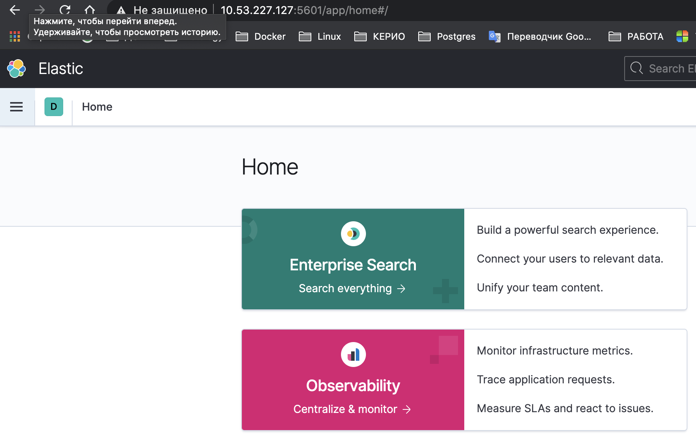

# Ответы на вопросы

* Ссылка на репозиторий с playbook
  [https://github.com/Ecriptor/elk-ansible-playbook](https://github.com/Ecriptor/elk-ansible-playbook)
  
### Задача
Cоздать плейбук, который:

* установит Java, Elasticsearch, Kibana в моем случае на 1 хост
* добавит ENV
* сконфигурирует Kibana которая доступна из интернета
### Рабочее окружение
```
* MACOS - хостовая машина откуда запускается playbook
* Redhat в AWS - ВМ на которую производим установку
* Java - необходимо положить в папку files, все остальное скачивается из интернета
* На ВМ - расположен public_key хостовой машины
```

### Запуск playbook
```bash
ansible-playbook -i inventory/prod.yml site.yml
```


### Запуск сервисов
В данном случае производим руками, но правильнее написать systemd.unit и запускать при помощи него
```bash
elasticsearch & 
kibana &
```

Скриншот запущенного приложения Kibana<br>

