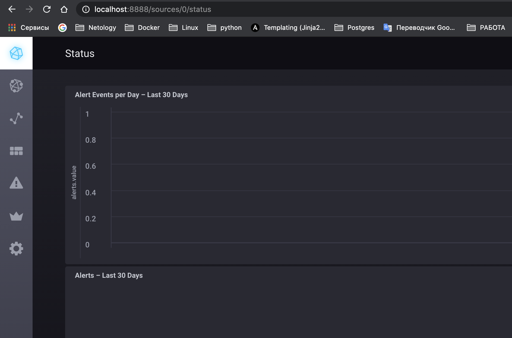
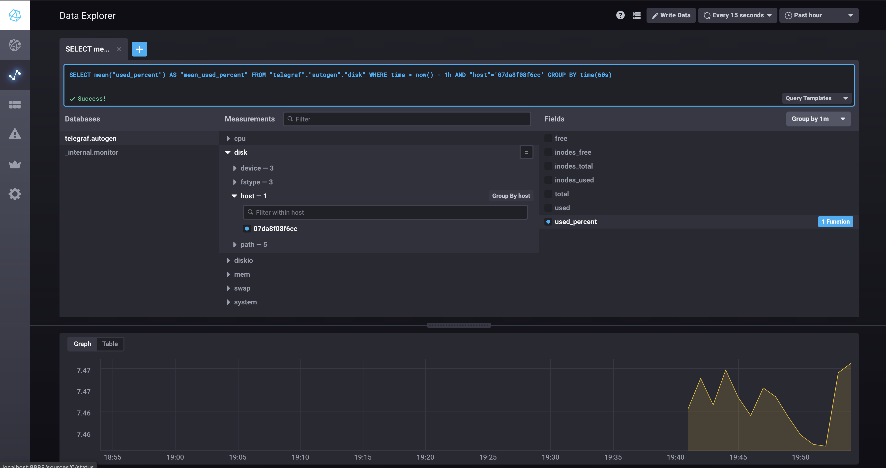
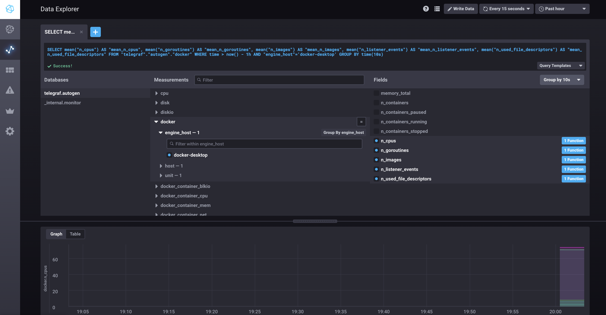
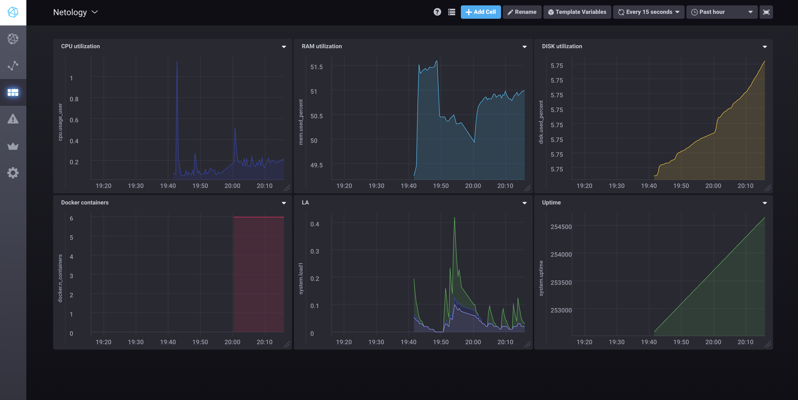

# Домашнее задание к занятию "10.02. Системы мониторинга"

## Обязательные задания

1. Опишите основные плюсы и минусы pull и push систем мониторинга.
```aidl
Pull:
Плюсы:
- Легче контролировать подлинность данных.
- Легче производить отладку
- Удобнее администрировать однотипные источники данных
Минусы:
- Необходим доступ до всех узлов с центрального сервера
- Меньше производительность при передаче
- Информация о проблемах поступает с задержкой
```
```aidl
Push:
Плюсы:
- Настройка отправки данных в разные системы мониторинга
- UDP  для увелечения производительности сбора метрик
- Более гибкая настройка частоты отправки данных
- узлы могут быть за файерволом из вне
Минусы:
- Возможна потеря данных если настроен UDP
- Настройки на стороне клиента
- Сложно контролировать подлинность данных
```

2. Какие из ниже перечисленных систем относятся к push модели, а какие к pull? А может есть гибридные?

    - Prometheus - `pull`
    - TICK - `push`
    - Zabbix - `pull/push`
    - VictoriaMetrics - `pull/push`
    - Nagios - `push`

3. Склонируйте себе [репозиторий](https://github.com/influxdata/TICK-docker/tree/master/1.3) и запустите TICK-стэк, 
используя технологии docker и docker-compose.

В виде решения на это упражнение приведите выводы команд с вашего компьютера (виртуальной машины):

    - curl http://localhost:8086/ping
```bash
Ничего!
```
    - curl http://localhost:8888
```aidl
<!DOCTYPE html>
<html>
  <head>
    <meta http-equiv="Content-type" content="text/html; charset=utf-8"/>
    <title>Chronograf</title>
  <link rel="shortcut icon" href="/favicon.ico"><link href="/chronograf.css" rel="stylesheet"></head>
  <body>
    <div id='react-root' data-basepath=""></div>
  <script type="text/javascript" src="/manifest.0b50876f6444e513725c.js"></script><script type="text/javascript" src="/vendor.36ee797884f822b1fbde.js"></script><script type="text/javascript" src="/app.3eec41dc0f57667d6ff4.js"></script></body>
</html>
```
    - curl http://localhost:9092/kapacitor/v1/ping
```aidl
Ничего!
```

А также скриншот веб-интерфейса ПО chronograf (`http://localhost:8888`).


P.S.: если при запуске некоторые контейнеры будут падать с ошибкой - проставьте им режим `Z`, например
`./data:/var/lib:Z`

4. Перейдите в веб-интерфейс Chronograf (`http://localhost:8888`) и откройте вкладку `Data explorer`.

    - Нажмите на кнопку `Add a query`
    - Изучите вывод интерфейса и выберите БД `telegraf.autogen`
    - В `measurments` выберите mem->host->telegraf_container_id , а в `fields` выберите used_percent. 
    Внизу появится график утилизации оперативной памяти в контейнере telegraf.
    - Вверху вы можете увидеть запрос, аналогичный SQL-синтаксису. 
    Поэкспериментируйте с запросом, попробуйте изменить группировку и интервал наблюдений.

Для выполнения задания приведите скриншот с отображением метрик утилизации места на диске 
(disk->host->telegraf_container_id) из веб-интерфейса.


5. Изучите список [telegraf inputs](https://github.com/influxdata/telegraf/tree/master/plugins/inputs). 
Добавьте в конфигурацию telegraf следующий плагин - [docker](https://github.com/influxdata/telegraf/tree/master/plugins/inputs/docker):
```
[[inputs.docker]]
  endpoint = "unix:///var/run/docker.sock"
```

Дополнительно вам может потребоваться донастройка контейнера telegraf в `docker-compose.yml` дополнительного volume и 
режима privileged:
```
  telegraf:
    image: telegraf:1.4.0
    privileged: true
    volumes:
      - ./etc/telegraf.conf:/etc/telegraf/telegraf.conf:Z
      - /var/run/docker.sock:/var/run/docker.sock:Z
    links:
      - influxdb
    ports:
      - "8092:8092/udp"
      - "8094:8094"
      - "8125:8125/udp"
```

После настройке перезапустите telegraf, обновите веб интерфейс и приведите скриншотом список `measurments` в 
веб-интерфейсе базы telegraf.autogen . Там должны появиться метрики, связанные с docker.

Факультативно можете изучить какие метрики собирает telegraf после выполнения данного задания.

## Дополнительное задание (со звездочкой*) - необязательно к выполнению

В веб-интерфейсе откройте вкладку `Dashboards`. Попробуйте создать свой dashboard с отображением:

    - утилизации ЦПУ
    - количества использованного RAM
    - утилизации пространства на дисках
    - количество поднятых контейнеров
    - аптайм
    - ...
    - фантазируйте)

