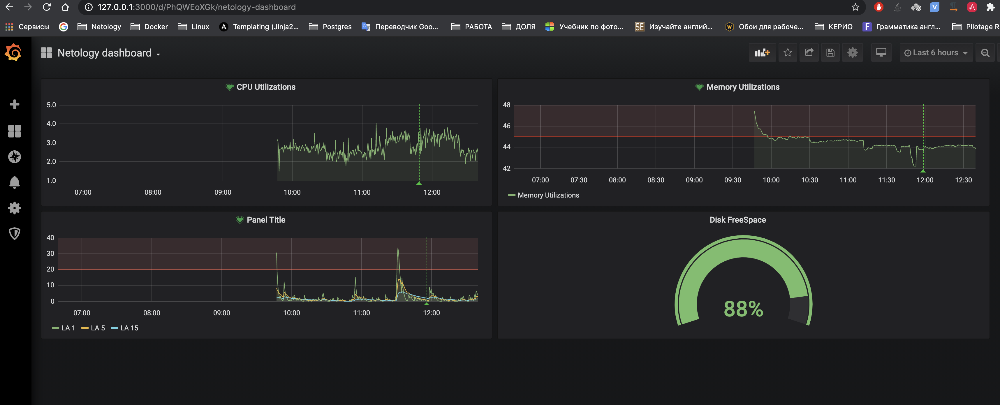

# Домашнее задание к занятию "10.03. Grafana"

## Задание повышенной сложности

**В части задания 1** не используйте директорию [help](./help) для сборки проекта, самостоятельно разверните grafana, где в 
роли источника данных будет выступать prometheus, а сборщиком данных node-exporter:
- grafana
- prometheus-server
- prometheus node-exporter

За дополнительными материалами, вы можете обратиться в официальную документацию grafana и prometheus.

В решении к домашнему заданию приведите также все конфигурации/скрипты/манифесты, которые вы 
использовали в процессе решения задания.

**В части задания 3** вы должны самостоятельно завести удобный для вас канал нотификации, например Telegram или Email
и отправить туда тестовые события.

В решении приведите скриншоты тестовых событий из каналов нотификаций.

## Обязательные задания

### Задание 1
Используя директорию [help](./help) внутри данного домашнего задания - запустите связку prometheus-grafana.

Зайдите в веб-интерфейс графана, используя авторизационные данные, указанные в манифесте docker-compose.

Подключите поднятый вами prometheus как источник данных.

Решение домашнего задания - скриншот веб-интерфейса grafana со списком подключенных Datasource.


## Задание 2
Изучите самостоятельно ресурсы:
- [promql-for-humans](https://timber.io/blog/promql-for-humans/#cpu-usage-by-instance)
- [understanding prometheus cpu metrics](https://www.robustperception.io/understanding-machine-cpu-usage)

Создайте Dashboard и в ней создайте следующие Panels:
- Утилизация CPU для nodeexporter (в процентах, 100-idle)
```
(((count(count(node_cpu_seconds_total) by (cpu))) - avg(sum by (mode)(irate(node_cpu_seconds_total{mode='idle'}[1m])))) * 100) / count(count(node_cpu_seconds_total) by (cpu))
```
- CPULA 1/5/15
```
avg(node_load1) /  count(count(node_cpu_seconds_total) by (cpu)) * 100
avg(node_load5) /  count(count(node_cpu_seconds_total) by (cpu)) * 100
avg(node_load15) /  count(count(node_cpu_seconds_total) by (cpu)) * 100
```
- Количество свободной оперативной памяти
```
node_memory_MemAvailable_bytes * 100) / node_memory_MemTotal_bytes
```
- Количество места на файловой системе
```
(node_filesystem_avail_bytes{mountpoint!=\"/\",fstype=\"ext4\"} * 100) / node_filesystem_size_bytes{mountpoint!=\"/\",fstype=\"ext4\"}
```

Для решения данного ДЗ приведите promql запросы для выдачи этих метрик, а также скриншот получившейся Dashboard.

## Задание 3
Создайте для каждой Dashboard подходящее правило alert (можно обратиться к первой лекции в блоке "Мониторинг").

Для решения ДЗ - приведите скриншот вашей итоговой Dashboard.

Оповещения в телеграм


## Задание 4
Сохраните ваш Dashboard.

Для этого перейдите в настройки Dashboard, выберите в боковом меню "JSON MODEL".

Далее скопируйте отображаемое json-содержимое в отдельный файл и сохраните его.

В решении задания - приведите листинг этого файла.
```json
{
  "annotations": {
    "list": [
      {
        "builtIn": 1,
        "datasource": "-- Grafana --",
        "enable": true,
        "hide": true,
        "iconColor": "rgba(0, 211, 255, 1)",
        "name": "Annotations & Alerts",
        "type": "dashboard"
      }
    ]
  },
  "editable": true,
  "gnetId": null,
  "graphTooltip": 0,
  "id": 8,
  "links": [],
  "panels": [
    {
      "alert": {
        "alertRuleTags": {},
        "conditions": [
          {
            "evaluator": {
              "params": [
                80
              ],
              "type": "gt"
            },
            "operator": {
              "type": "and"
            },
            "query": {
              "params": [
                "A",
                "5m",
                "now"
              ]
            },
            "reducer": {
              "params": [],
              "type": "avg"
            },
            "type": "query"
          }
        ],
        "executionErrorState": "alerting",
        "for": "5m",
        "frequency": "1m",
        "handler": 1,
        "message": "Netology Test",
        "name": "CPU Utilizations alert",
        "noDataState": "no_data",
        "notifications": [
          {
            "uid": "uNy7YouGk"
          }
        ]
      },
      "aliasColors": {},
      "bars": false,
      "cacheTimeout": null,
      "dashLength": 10,
      "dashes": false,
      "datasource": "Prometheus",
      "fill": 1,
      "fillGradient": 0,
      "gridPos": {
        "h": 6,
        "w": 11,
        "x": 0,
        "y": 0
      },
      "hiddenSeries": false,
      "id": 2,
      "legend": {
        "alignAsTable": false,
        "avg": false,
        "current": false,
        "max": false,
        "min": false,
        "show": false,
        "total": false,
        "values": false
      },
      "lines": true,
      "linewidth": 1,
      "links": [],
      "nullPointMode": "null",
      "options": {
        "dataLinks": []
      },
      "percentage": false,
      "pluginVersion": "6.7.2",
      "pointradius": 2,
      "points": false,
      "renderer": "flot",
      "seriesOverrides": [],
      "spaceLength": 10,
      "stack": false,
      "steppedLine": false,
      "targets": [
        {
          "expr": "(((count(count(node_cpu_seconds_total) by (cpu))) - avg(sum by (mode)(irate(node_cpu_seconds_total{mode='idle'}[1m])))) * 100) / count(count(node_cpu_seconds_total) by (cpu))",
          "instant": false,
          "interval": "",
          "intervalFactor": 1,
          "legendFormat": "",
          "refId": "A"
        }
      ],
      "thresholds": [
        {
          "colorMode": "critical",
          "fill": true,
          "line": true,
          "op": "gt",
          "value": 80
        }
      ],
      "timeFrom": null,
      "timeRegions": [],
      "timeShift": null,
      "title": "CPU Utilizations",
      "tooltip": {
        "shared": true,
        "sort": 0,
        "value_type": "individual"
      },
      "type": "graph",
      "xaxis": {
        "buckets": null,
        "mode": "time",
        "name": null,
        "show": true,
        "values": []
      },
      "yaxes": [
        {
          "format": "short",
          "label": null,
          "logBase": 1,
          "max": null,
          "min": null,
          "show": true
        },
        {
          "format": "short",
          "label": "",
          "logBase": 1,
          "max": null,
          "min": null,
          "show": true
        }
      ],
      "yaxis": {
        "align": false,
        "alignLevel": null
      }
    },
    {
      "alert": {
        "alertRuleTags": {},
        "conditions": [
          {
            "evaluator": {
              "params": [
                45
              ],
              "type": "gt"
            },
            "operator": {
              "type": "and"
            },
            "query": {
              "params": [
                "A",
                "5m",
                "now"
              ]
            },
            "reducer": {
              "params": [],
              "type": "avg"
            },
            "type": "query"
          }
        ],
        "executionErrorState": "alerting",
        "for": "5m",
        "frequency": "1m",
        "handler": 1,
        "name": "Memory Utilizations alert",
        "noDataState": "no_data",
        "notifications": [
          {
            "uid": "uNy7YouGk"
          }
        ]
      },
      "aliasColors": {},
      "bars": false,
      "dashLength": 10,
      "dashes": false,
      "datasource": null,
      "fill": 1,
      "fillGradient": 0,
      "gridPos": {
        "h": 6,
        "w": 12,
        "x": 11,
        "y": 0
      },
      "hiddenSeries": false,
      "id": 6,
      "legend": {
        "avg": false,
        "current": false,
        "max": false,
        "min": false,
        "show": true,
        "total": false,
        "values": false
      },
      "lines": true,
      "linewidth": 1,
      "nullPointMode": "null",
      "options": {
        "dataLinks": []
      },
      "percentage": false,
      "pointradius": 2,
      "points": false,
      "renderer": "flot",
      "seriesOverrides": [],
      "spaceLength": 10,
      "stack": false,
      "steppedLine": false,
      "targets": [
        {
          "expr": "(node_memory_MemAvailable_bytes * 100) / node_memory_MemTotal_bytes",
          "interval": "",
          "legendFormat": "{{ Memory Utilizations }}",
          "refId": "A"
        }
      ],
      "thresholds": [
        {
          "colorMode": "critical",
          "fill": true,
          "line": true,
          "op": "gt",
          "value": 45
        }
      ],
      "timeFrom": null,
      "timeRegions": [],
      "timeShift": null,
      "title": "Memory Utilizations",
      "tooltip": {
        "shared": true,
        "sort": 0,
        "value_type": "individual"
      },
      "type": "graph",
      "xaxis": {
        "buckets": null,
        "mode": "time",
        "name": null,
        "show": true,
        "values": []
      },
      "yaxes": [
        {
          "format": "short",
          "label": null,
          "logBase": 1,
          "max": null,
          "min": null,
          "show": true
        },
        {
          "format": "short",
          "label": null,
          "logBase": 1,
          "max": null,
          "min": null,
          "show": true
        }
      ],
      "yaxis": {
        "align": false,
        "alignLevel": null
      }
    },
    {
      "alert": {
        "alertRuleTags": {},
        "conditions": [
          {
            "evaluator": {
              "params": [
                20
              ],
              "type": "gt"
            },
            "operator": {
              "type": "and"
            },
            "query": {
              "params": [
                "A",
                "5m",
                "now"
              ]
            },
            "reducer": {
              "params": [],
              "type": "avg"
            },
            "type": "query"
          }
        ],
        "executionErrorState": "alerting",
        "for": "5m",
        "frequency": "1m",
        "handler": 1,
        "name": "Panel Title alert",
        "noDataState": "no_data",
        "notifications": [
          {
            "uid": "uNy7YouGk"
          }
        ]
      },
      "aliasColors": {},
      "bars": false,
      "dashLength": 10,
      "dashes": false,
      "datasource": null,
      "fill": 1,
      "fillGradient": 0,
      "gridPos": {
        "h": 6,
        "w": 11,
        "x": 0,
        "y": 6
      },
      "hiddenSeries": false,
      "id": 4,
      "legend": {
        "alignAsTable": false,
        "avg": false,
        "current": false,
        "max": false,
        "min": false,
        "rightSide": false,
        "show": true,
        "total": false,
        "values": false
      },
      "lines": true,
      "linewidth": 1,
      "nullPointMode": "null",
      "options": {
        "dataLinks": []
      },
      "percentage": false,
      "pluginVersion": "6.7.2",
      "pointradius": 2,
      "points": false,
      "renderer": "flot",
      "seriesOverrides": [],
      "spaceLength": 10,
      "stack": false,
      "steppedLine": false,
      "targets": [
        {
          "expr": "avg(node_load1) /  count(count(node_cpu_seconds_total) by (cpu)) * 100",
          "instant": false,
          "interval": "",
          "legendFormat": "{{ LA 1 }}",
          "refId": "A"
        },
        {
          "expr": "avg(node_load5) /  count(count(node_cpu_seconds_total) by (cpu)) * 100",
          "interval": "",
          "legendFormat": "{{ LA 5 }}",
          "refId": "B"
        },
        {
          "expr": "avg(node_load15) /  count(count(node_cpu_seconds_total) by (cpu)) * 100",
          "interval": "",
          "legendFormat": "{{ LA 15 }}",
          "refId": "C"
        }
      ],
      "thresholds": [
        {
          "colorMode": "critical",
          "fill": true,
          "line": true,
          "op": "gt",
          "value": 20
        }
      ],
      "timeFrom": null,
      "timeRegions": [],
      "timeShift": null,
      "title": "Panel Title",
      "tooltip": {
        "shared": true,
        "sort": 0,
        "value_type": "individual"
      },
      "type": "graph",
      "xaxis": {
        "buckets": null,
        "mode": "time",
        "name": null,
        "show": true,
        "values": []
      },
      "yaxes": [
        {
          "format": "short",
          "label": null,
          "logBase": 1,
          "max": null,
          "min": null,
          "show": true
        },
        {
          "format": "short",
          "label": null,
          "logBase": 1,
          "max": null,
          "min": null,
          "show": true
        }
      ],
      "yaxis": {
        "align": false,
        "alignLevel": null
      }
    },
    {
      "cacheTimeout": null,
      "datasource": null,
      "gridPos": {
        "h": 6,
        "w": 12,
        "x": 11,
        "y": 6
      },
      "id": 8,
      "links": [],
      "options": {
        "fieldOptions": {
          "calcs": [
            "mean"
          ],
          "defaults": {
            "mappings": [],
            "thresholds": {
              "mode": "absolute",
              "steps": [
                {
                  "color": "green",
                  "value": null
                }
              ]
            },
            "unit": "percent"
          },
          "overrides": [],
          "values": false
        },
        "orientation": "auto",
        "showThresholdLabels": false,
        "showThresholdMarkers": true
      },
      "pluginVersion": "6.7.2",
      "targets": [
        {
          "expr": "(node_filesystem_avail_bytes{mountpoint!=\"/\",fstype=\"ext4\"} * 100) / node_filesystem_size_bytes{mountpoint!=\"/\",fstype=\"ext4\"}",
          "format": "time_series",
          "instant": false,
          "interval": "",
          "intervalFactor": 1,
          "legendFormat": "{{Free space}}",
          "refId": "A"
        }
      ],
      "timeFrom": null,
      "timeShift": null,
      "title": "Disk FreeSpace",
      "type": "gauge"
    }
  ],
  "refresh": false,
  "schemaVersion": 22,
  "style": "dark",
  "tags": [],
  "templating": {
    "list": []
  },
  "time": {
    "from": "now-15m",
    "to": "now"
  },
  "timepicker": {
    "refresh_intervals": [
      "5s",
      "10s",
      "30s",
      "1m",
      "5m",
      "15m",
      "30m",
      "1h",
      "2h",
      "1d"
    ]
  },
  "timezone": "",
  "title": "Netology dashboard",
  "uid": "PhQWEoXGk",
  "variables": {
    "list": []
  },
  "version": 7
}
```
