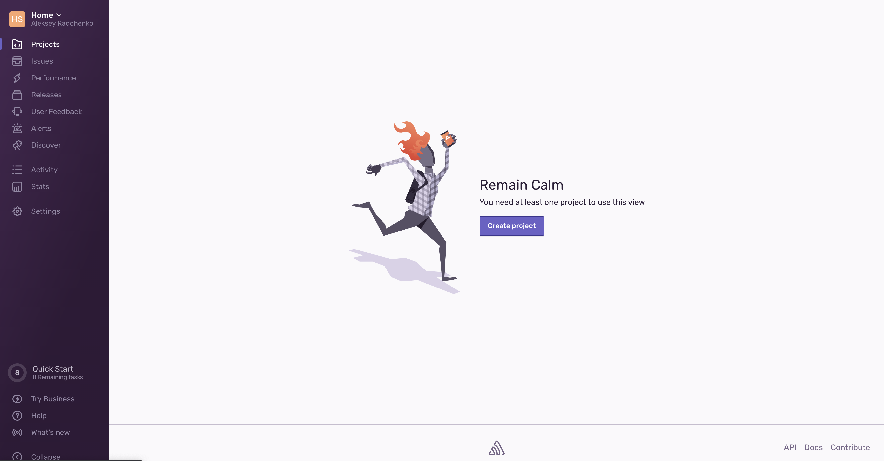
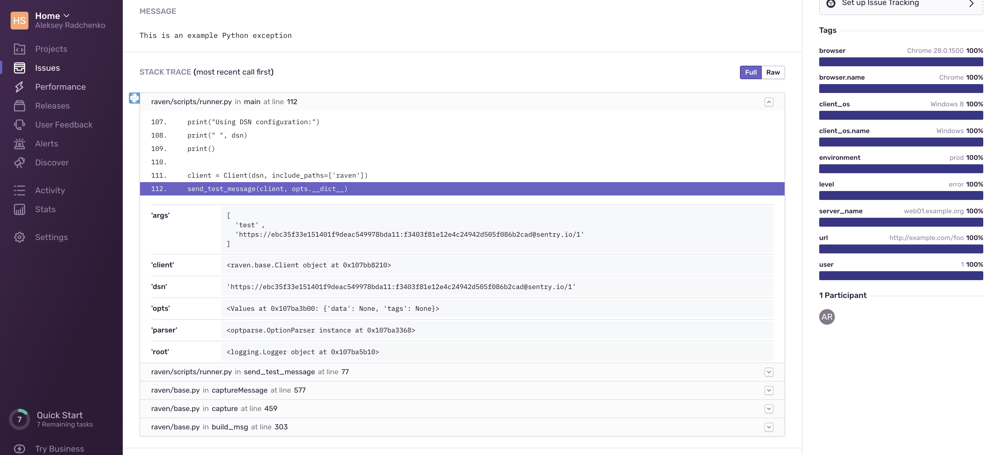
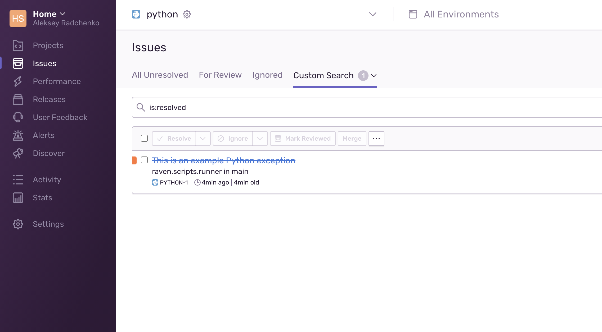
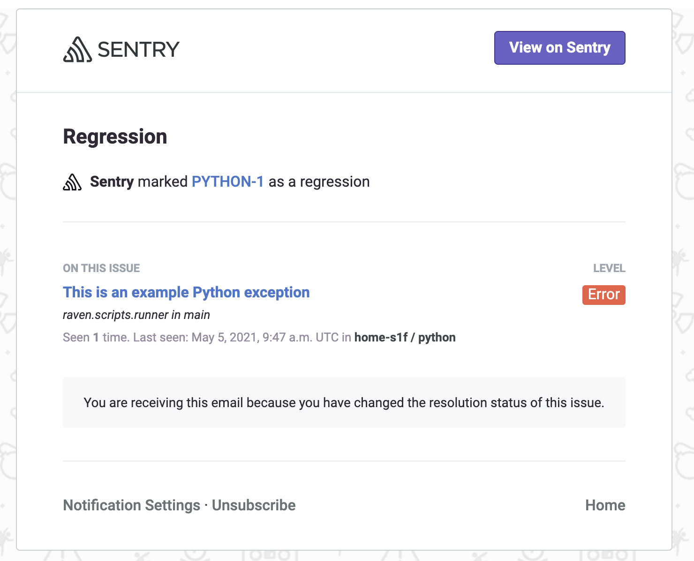

# Домашнее задание к занятию "10.05. Sentry"

## Задание 1

Для выполнения задания - пришлите скриншот меню Projects.

## Задание 2

Для выполнения задание предоставьте скриншот `Stack trace` из этого события.

Cписок событий проекта, после нажатия `Resolved`.

## Задание 3

Для выполнения задания - пришлите скриншот тела сообщения из оповещения на почте.

