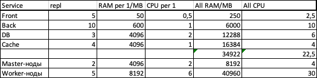
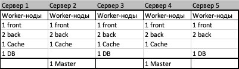

# Домашнее задание к занятию "12.3 Развертывание кластера на собственных серверах, лекция 1"
Поработав с персональным кластером, можно заняться проектами. Вам пришла задача подготовить кластер под новый проект.

## Задание 1: Описать требования к кластеру
Сначала проекту необходимо определить требуемые ресурсы. Известно, что проекту нужны база данных, система кеширования, а само приложение состоит из бекенда и фронтенда. Опишите, какие ресурсы нужны, если известно:

* база данных должна быть отказоустойчивой (не менее трех копий, master-slave) и потребляет около 4 ГБ ОЗУ в работе;
* кэш должен быть аналогично отказоустойчивый, более трех копий, потребление: 4 ГБ ОЗУ, 1 ядро;
* фронтенд обрабатывает внешние запросы быстро, отдавая статику: не более 50 МБ ОЗУ на каждый экземпляр;
* бекенду требуется больше: порядка 600 МБ ОЗУ и по 1 ядру на копию.

Требования: опишите, сколько нод в кластере и сколько ресурсов (ядра, ОЗУ, диск) нужно для запуска приложения. Расчет вести из необходимости запуска 5 копий фронтенда и 10 копий бекенда, база и кеш.

### Решение!
Как то так видится вся ситуация, если БД и КЕШ тоже должны работать на воркерах (хотя я считаю что БД должны быть на отдельных ВМ)

Либо закупить 5 физ серверов с 6 CPU и 10 GB RAM, каждый

Либо развернуть в облаке!
- 2 сервера для Мастера 2 CPU и 4 GB RAM, каждый
- 3 сервера для Воркера пожирней 6 CPU и 10 GB RAM, каждый
- 2 сервера для воркера послабее 4 CPU и 6 GB RAM, каждый

