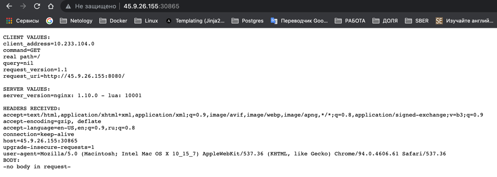
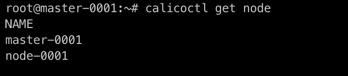
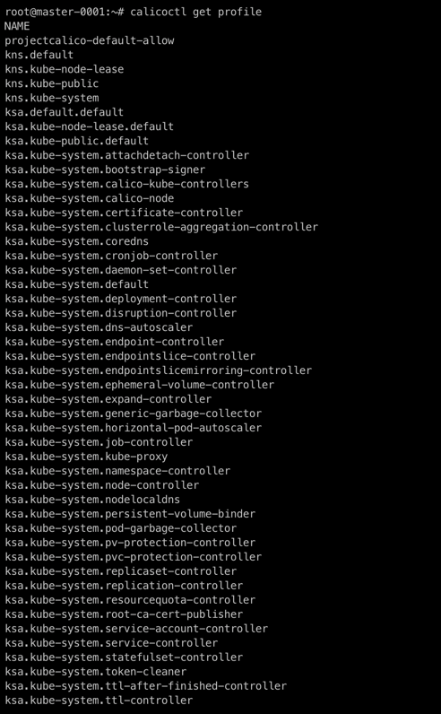

# Домашнее задание к занятию "12.5 Сетевые решения CNI"
После работы с Flannel появилась необходимость обеспечить безопасность для приложения. Для этого лучше всего подойдет Calico.
## Задание 1: установить в кластер CNI плагин Calico
Для проверки других сетевых решений стоит поставить отличный от Flannel плагин — например, Calico. Требования: 
* установка производится через ansible/kubespray;
* после применения следует настроить политику доступа к hello world извне.

### Решение

- Кластер создан при помощи kubespray поэтому тут по умолчанию Calico

```
root@master-0001:~# kubectl describe nodes master-0001
...
Non-terminated Pods:          (6 in total)
  Namespace                   Name                                   CPU Requests  CPU Limits  Memory Requests  Memory Limits  Age
  ---------                   ----                                   ------------  ----------  ---------------  -------------  ---
  kube-system                 calico-node-pl4xh                      150m (18%)    300m (37%)  64M (4%)         500M (34%)     26h
  kube-system                 coredns-8474476ff8-nc64z               100m (12%)    0 (0%)      70Mi (5%)        170Mi (12%)    26h
  kube-system                 kube-apiserver-master-0001             250m (31%)    0 (0%)      0 (0%)           0 (0%)         26h
  kube-system                 kube-controller-manager-master-0001    200m (25%)    0 (0%)      0 (0%)           0 (0%)         26h
  kube-system                 kube-proxy-wnxwt                       0 (0%)        0 (0%)      0 (0%)           0 (0%)         26h
  kube-system                 kube-scheduler-master-0001             100m (12%)    0 (0%)      0 (0%)           0 (0%)         26h
...
```
- Пробросим pod hello-world во внешний мир
```shell
root@master-0001:~# kubectl expose deployment hello-node --type=LoadBalancer --port=8080
# Посмотрим порт на котором доступен сервис
root@master-0001:~# kubectl get services
NAME         TYPE           CLUSTER-IP     EXTERNAL-IP   PORT(S)          AGE
hello-node   LoadBalancer   10.233.63.65   <pending>     8080:30865/TCP   32m
kubernetes   ClusterIP      10.233.0.1     <none>        443/TCP          26h
```
- Сервис доступен извне http://45.9.26.155:30865/ на момент проверки ДЗ ссылка будет жива


## Задание 2: изучить, что запущено по умолчанию
Самый простой способ — проверить командой calicoctl get <type>. Для проверки стоит получить список нод, ipPool и profile.
Требования: 
* установить утилиту calicoctl;
* получить 3 вышеописанных типа в консоли.

### Решение
- Утилита устанавливается совместно с Calico
- Вывод всех 3х команд
 




