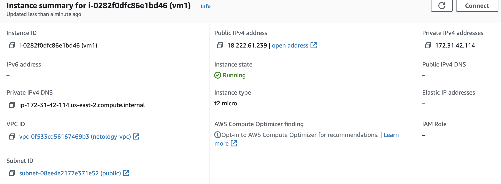
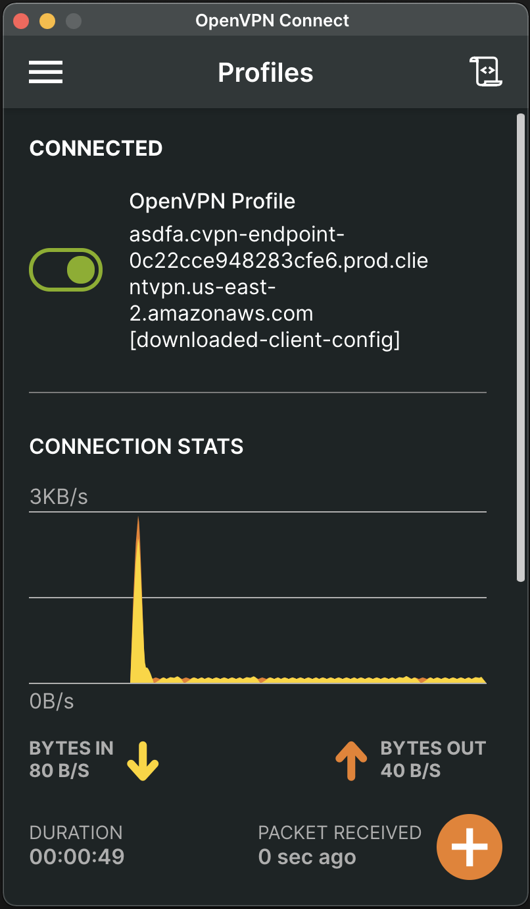
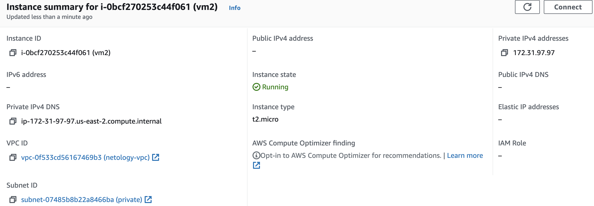

# Домашнее задание к занятию "15.1. Организация сети"

Настроить Production like сеть в рамках одной зоны с помощью terraform. Модуль VPC умеет автоматически делать все что есть в этом задании. Но мы воспользуемся более низкоуровневыми абстракциями, чтобы понять, как оно устроено внутри.

1. Создать VPC.

- Используя vpc-модуль terraform, создать пустую VPC с подсетью 172.31.0.0/16.
- Выбрать регион и зону.

2. Публичная сеть.

- Создать в vpc subnet с названием public, сетью 172.31.32.0/19 и Internet gateway.
- Добавить RouteTable, направляющий весь исходящий трафик в Internet gateway.
- Создать в этой приватной сети виртуалку с публичным IP и подключиться к ней, убедиться что есть доступ к интернету.

3. Приватная сеть.

- Создать в vpc subnet с названием private, сетью 172.31.96.0/19.
- Добавить NAT gateway в public subnet.
- Добавить Route, направляющий весь исходящий трафик private сети в NAT.

4. VPN.

- Настроить VPN, соединить его с сетью private.
- Создать себе учетную запись и подключиться через нее.
- Создать виртуалку в приватной сети.
- Подключиться к ней по SSH по приватному IP и убедиться, что с виртуалки есть выход в интернет.

### Решение

Конфигурационный файл [terraform/main.tf](terraform/main.tf)

```

provider "aws" {
    region = "us-east-2"
}

data "aws_ami" "ubuntu" {
  most_recent = true

  filter {
    name   = "name"
    values = ["ubuntu/images/hvm-ssd/ubuntu-focal-20.04-amd64-server-*"]
  }

  filter {
    name   = "virtualization-type"
    values = ["hvm"]
  }
  owners = ["099720109477"] # Canonical
}

/* 1.====Создать VPC=== */

resource "aws_vpc" "netology-vpc" {
  cidr_block = "172.31.0.0/16"

  tags = {
    Name = "netology-vpc"
  }
}

resource "aws_security_group" "netology-sg" {
  name   = "netology-sg"
  vpc_id = aws_vpc.netology-vpc.id

  egress {
    protocol    = -1
    from_port   = 0 
    to_port     = 0 
    cidr_blocks = ["0.0.0.0/0"]
  }
}

resource "aws_security_group_rule" "ssh" {
  type              = "ingress"
  from_port         = 22
  to_port           = 22
  protocol          = "tcp"
  cidr_blocks       = ["0.0.0.0/0"]
  security_group_id = aws_security_group.netology-sg.id
}

resource "aws_security_group_rule" "icmp" {
  type              = "ingress"
  from_port         = -1
  to_port           = -1
  protocol          = "icmp"
  cidr_blocks       = ["0.0.0.0/0"]
  security_group_id = aws_security_group.netology-sg.id
}


/* 2. ====Публичная сеть=== */

resource "aws_subnet" "public" {
  vpc_id     = aws_vpc.netology-vpc.id
  cidr_block = "172.31.32.0/19"
  availability_zone = "us-east-2c"
  map_public_ip_on_launch = true

  tags = {
    Name = "public"
  }
}

resource "aws_internet_gateway" "netology-gw" {
  vpc_id = aws_vpc.netology-vpc.id

  tags = {
    Name = "netology-gw"
  }
}

resource "aws_route_table" "public-route" {
  vpc_id = aws_vpc.netology-vpc.id

  route {
      cidr_block = "0.0.0.0/0"
      gateway_id = aws_internet_gateway.netology-gw.id
    }

  tags = {
    Name = "public-route"
  }
}

resource "aws_route_table_association" "netology-rtassoc1" {
     subnet_id      = aws_subnet.public.id
     route_table_id = aws_route_table.public-route.id
}

resource "aws_key_pair" "vm1-key" {
  key_name   = "vm1-key"
  public_key = "ssh-rsa AAAAB3NzaC1yc2EAAAADAQABAAABAQC3jPcGUpn2D2hOZ6m2BIG1FPux6vMmvVUqCElHbJCBfiIFIeqXl+9s+uzL7z4lMz92+fhExy+SfivSC2sMRgbLF6odvjoziGjfFb9jaWdntUqNPOd5MjSxSHLztq0N08E//cg5SzqaVghW/Fjom8QhEYBlzPZ7rNbs3fVwRN4MXpC8E1IkUQMwJU6D0bzERSDw6kK6y7XQ7Qm6xo/QFPaz7YWlrI07Efgjz0GY3lHv5MFlgMKiIZdIE7BGoAP8m9VxyvfNB1aXquoYtktOoVgMVXbNsGjboMzVyyHqBD1HFBhebzuvybOFyttoQ68x2ZXdfNTHYp7I9nLfrDDP8wFl ecriptor@CAB-WSM-0009889"
}

/* ===Создаем vm1 в публичной сети */

resource "aws_instance" "vm1" {
  ami           = data.aws_ami.ubuntu.id
  instance_type = "t2.micro"
  key_name  = aws_key_pair.vm1-key.key_name
  count = 1

  subnet_id = aws_subnet.public.id
  associate_public_ip_address = true
  security_groups = [ aws_security_group.netology-sg.id ]

  tags = {
    Name = "vm1"
  }
}

/* 3. ====Приватная сеть===== */

resource "aws_subnet" "private" {
  vpc_id     = aws_vpc.netology-vpc.id
  cidr_block = "172.31.96.0/19"
  availability_zone = "us-east-2c"

  tags = {
    Name = "private"
  }
}

resource "aws_eip" "nat_gateway" {
  vpc = true
}

resource "aws_nat_gateway" "netology-nat-gw" {
  subnet_id = aws_subnet.public.id
  allocation_id = aws_eip.nat_gateway.id

  tags = {
    Name = "netology-nat-gw"
  }
}

resource "aws_route_table" "private-route" {
  vpc_id = aws_vpc.netology-vpc.id

  route {
      cidr_block = "0.0.0.0/0"
      gateway_id = aws_nat_gateway.netology-nat-gw.id
    }

  tags = {
    Name = "private-route"
  }
}

resource "aws_route_table_association" "netology-rtassoc2" {
     subnet_id      = aws_subnet.private.id
     route_table_id = aws_route_table.private-route.id
}


/* === 4. VPN === */


resource "aws_acm_certificate" "vpn_server_cert" {
  private_key = file("certs/server.key")
  certificate_body = file("certs/server.crt")
  certificate_chain = file("certs/ca.crt")
}

resource "aws_acm_certificate" "vpn_client_cert" {
  private_key = file("certs/client1.domain.tld.key")
  certificate_body = file("certs/client1.domain.tld.crt")
  certificate_chain = file("certs/ca.crt")
}

resource "aws_ec2_client_vpn_endpoint" "vpn-ep" {
  description            = "vpn-ep"
  server_certificate_arn = aws_acm_certificate.vpn_server_cert.arn
  client_cidr_block      = "10.0.0.0/22"
  split_tunnel = true

  authentication_options {
    type                       = "certificate-authentication"
    root_certificate_chain_arn = aws_acm_certificate.vpn_client_cert.arn
  }

  connection_log_options {
    enabled               = false
  }
}

resource "aws_security_group" "vpn_access" {
  vpc_id = aws_vpc.netology-vpc.id
  name = "vpn-netology-sg"

  ingress {
    from_port = 443
    protocol = "UDP"
    to_port = 443
    cidr_blocks = ["0.0.0.0/0"]
    description = "Incoming VPN connection"
  }

  egress {
    from_port = 0
    protocol = "-1"
    to_port = 0
    cidr_blocks = ["0.0.0.0/0"]
  }
}

resource "aws_ec2_client_vpn_network_association" "vpn_subnets" {
  client_vpn_endpoint_id = aws_ec2_client_vpn_endpoint.vpn-ep.id
  subnet_id = aws_subnet.private.id
  security_groups = [aws_security_group.vpn_access.id]
}

resource "aws_ec2_client_vpn_authorization_rule" "vpn_auth_rule" {
  client_vpn_endpoint_id = aws_ec2_client_vpn_endpoint.vpn-ep.id
  target_network_cidr = aws_subnet.private.cidr_block
  authorize_all_groups = true
}

resource "aws_key_pair" "vm2-key" {
  key_name   = "vm2-key"
  public_key = "ssh-rsa AAAAB3NzaC1yc2EAAAADAQABAAABAQC3jPcGUpn2D2hOZ6m2BIG1FPux6vMmvVUqCElHbJCBfiIFIeqXl+9s+uzL7z4lMz92+fhExy+SfivSC2sMRgbLF6odvjoziGjfFb9jaWdntUqNPOd5MjSxSHLztq0N08E//cg5SzqaVghW/Fjom8QhEYBlzPZ7rNbs3fVwRN4MXpC8E1IkUQMwJU6D0bzERSDw6kK6y7XQ7Qm6xo/QFPaz7YWlrI07Efgjz0GY3lHv5MFlgMKiIZdIE7BGoAP8m9VxyvfNB1aXquoYtktOoVgMVXbNsGjboMzVyyHqBD1HFBhebzuvybOFyttoQ68x2ZXdfNTHYp7I9nLfrDDP8wFl ecriptor@CAB-WSM-0009889"
}

/* ===Создаем vm2 в приватной сети с VPN */

resource "aws_instance" "vm2" {
  ami           = data.aws_ami.ubuntu.id
  instance_type = "t2.micro"
  key_name  = aws_key_pair.vm2-key.key_name
  count = 1

  subnet_id = aws_subnet.private.id
  security_groups = [ aws_security_group.netology-sg.id ]

  tags = {
    Name = "vm2"
  }

}

```
- 1. Подключаемся к VM1 по публичному адресу

```
ssh ubuntu@18.222.61.239

ubuntu@ip-172-31-42-114:~$ ping 8.8.8.8
PING 8.8.8.8 (8.8.8.8) 56(84) bytes of data.
64 bytes from 8.8.8.8: icmp_seq=1 ttl=93 time=11.3 ms
64 bytes from 8.8.8.8: icmp_seq=2 ttl=93 time=11.3 ms
64 bytes from 8.8.8.8: icmp_seq=3 ttl=93 time=11.4 ms
64 bytes from 8.8.8.8: icmp_seq=4 ttl=93 time=11.3 ms
64 bytes from 8.8.8.8: icmp_seq=5 ttl=93 time=11.3 ms
64 bytes from 8.8.8.8: icmp_seq=6 ttl=93 time=11.3 ms
^C
--- 8.8.8.8 ping statistics ---
6 packets transmitted, 6 received, 0% packet loss, time 5008ms
rtt min/avg/max/mdev = 11.275/11.325/11.368/0.027 ms
```
- 2. Подключаемся к OpenVPN, скачав файл конфигурации [downloaded-client-config.ovpn](downloaded-client-config.ovpn) с AWS и добавив в него клиентские сертификаты

- 3. Подключаемся к VM2 по приватному адресу

```
ssh ubuntu@172.31.97.97

ubuntu@ip-172-31-97-97:~$ ping 8.8.8.8
PING 8.8.8.8 (8.8.8.8) 56(84) bytes of data.
64 bytes from 8.8.8.8: icmp_seq=1 ttl=93 time=11.6 ms
64 bytes from 8.8.8.8: icmp_seq=2 ttl=93 time=11.1 ms
64 bytes from 8.8.8.8: icmp_seq=3 ttl=93 time=11.8 ms
64 bytes from 8.8.8.8: icmp_seq=4 ttl=93 time=11.2 ms
64 bytes from 8.8.8.8: icmp_seq=5 ttl=93 time=11.2 ms
^C
--- 8.8.8.8 ping statistics ---
5 packets transmitted, 5 received, 0% packet loss, time 4007ms
rtt min/avg/max/mdev = 11.109/11.372/11.777/0.266 ms
```

Документация по AWS-ресурсам:

- [Getting started with Client VPN](https://docs.aws.amazon.com/vpn/latest/clientvpn-admin/cvpn-getting-started.html)

Модули terraform

- [VPC](https://registry.terraform.io/providers/hashicorp/aws/latest/docs/resources/vpc)
- [Subnet](https://registry.terraform.io/providers/hashicorp/aws/latest/docs/resources/subnet)
- [Internet Gateway](https://registry.terraform.io/providers/hashicorp/aws/latest/docs/resources/internet_gateway)
