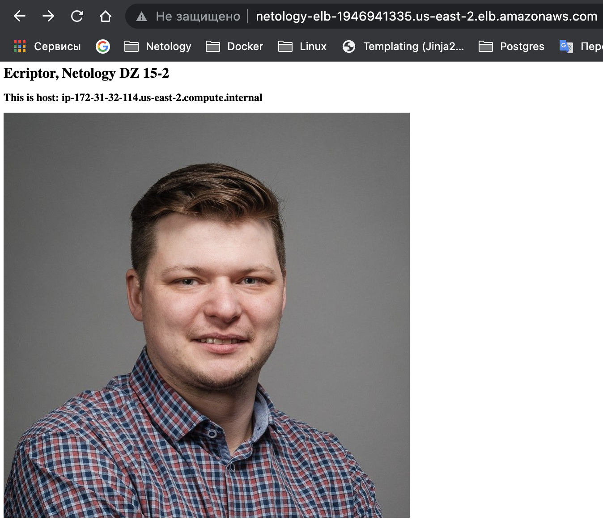
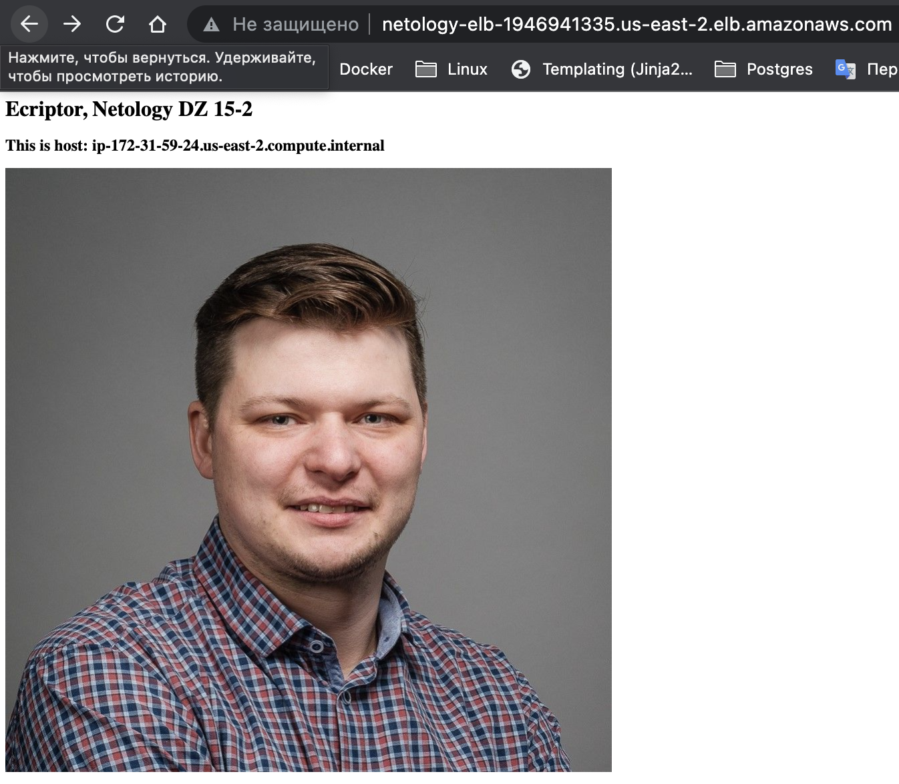

# Домашнее задание к занятию 15.2 "Вычислительные мощности. Балансировщики нагрузки".

Используя конфигурации, выполненные в рамках ДЗ на предыдущем занятии добавить к Production like сети Autoscaling group из 2 EC2-инстансов с  автоматической установкой web-сервера в private домен. Создать приватный домен в Route53, чтобы был доступ из VPN.

## Задание 1. Создать bucket S3 и разместить там файл с картинкой.

- Создать бакет в S3 с произвольным именем (например, имя_студента_дата).
- Положить в бакет файл с картинкой.
- Сделать доступным из VPN используя ACL.

---

## Задание 2. Создать запись в Route53 домен с возможностью определения из VPN.

- Сделать запись в Route53 на приватный домен, указав адрес LB.

---

## Задание 3. Загрузить несколько ЕС2-инстансов с веб-страницей, на которой будет картинка из S3.

- Сделать Launch configurations с использованием bootstrap скрипта с созданием веб-странички на которой будет ссылка на картинку в S3.
- Загрузить 3 ЕС2-инстанса и настроить LB с помощью Autoscaling Group.

### Решение
```tf
provider "aws" {
    region = "us-east-2"
}

data "aws_ami" "amazon-linux" {
  most_recent = true

  filter {
    name   = "name"
    values = ["amzn2-ami-hvm-2.0.*-x86_64-gp2"]
  }

  filter {
    name   = "virtualization-type"
    values = ["hvm"]
  }

  owners = ["137112412989"] # Amazon
}

/* ====Создать VPC==== */

resource "aws_vpc" "netology-vpc" {
  cidr_block = "172.31.0.0/16"

  tags = {
    Name = "netology-vpc"
  }
}

resource "aws_security_group" "netology-sg" {
  name   = "netology-sg"
  vpc_id = aws_vpc.netology-vpc.id

  egress {
    protocol    = -1
    from_port   = 0
    to_port     = 0
    cidr_blocks = ["0.0.0.0/0"]
  }
}

resource "aws_security_group_rule" "ssh" {
  type              = "ingress"
  from_port         = 22
  to_port           = 22
  protocol          = "tcp"
  cidr_blocks       = ["0.0.0.0/0"]
  security_group_id = aws_security_group.netology-sg.id
}

resource "aws_security_group_rule" "icmp" {
  type              = "ingress"
  from_port         = -1
  to_port           = -1
  protocol          = "icmp"
  cidr_blocks       = ["0.0.0.0/0"]
  security_group_id = aws_security_group.netology-sg.id
}

/* ====Публичная сеть==== */

resource "aws_subnet" "public" {
  vpc_id     = aws_vpc.netology-vpc.id
  cidr_block = "172.31.32.0/19"
  availability_zone = "us-east-2c"
  map_public_ip_on_launch = true

  tags = {
    Name = "public"
  }
}

resource "aws_internet_gateway" "netology-gw" {
  vpc_id = aws_vpc.netology-vpc.id

  tags = {
    Name = "netology-gw"
  }
}

resource "aws_route_table" "public-route" {
  vpc_id = aws_vpc.netology-vpc.id

  route {
      cidr_block = "0.0.0.0/0"
      gateway_id = aws_internet_gateway.netology-gw.id
    }

  tags = {
    Name = "public-route"
  }
}

resource "aws_route_table_association" "netology-rtassoc1" {
     subnet_id      = aws_subnet.public.id
     route_table_id = aws_route_table.public-route.id
}

/* ==== S3 ==== */

resource "aws_s3_bucket" "bucket" {
  bucket = "netology-dz"
  acl    = "private"
  tags = {
    Name    = "My bucket"
  }
}

resource "aws_s3_bucket_object" "img" {
  bucket = aws_s3_bucket.bucket.id
  key    = "avatar.jpg"
  source = "avatar.jpg"
  acl    = "public-read"
}

data "aws_s3_bucket" "bucket" {
  bucket = aws_s3_bucket.bucket.id
}

data "aws_s3_bucket_object" "img" {
  bucket = aws_s3_bucket.bucket.id
  key    = aws_s3_bucket_object.img.id
}

/* ==== ROUTE ==== */

resource "aws_route53_zone" "private" {
  name = "ecriptor.local"

  vpc {
    vpc_id = aws_vpc.netology-vpc.id
  }
}

resource "aws_route53_record" "www" {
  zone_id = aws_route53_zone.private.zone_id
  name    = "www.ecriptor.local"
  type    = "CNAME"
  ttl     = "300"
  records = [aws_elb.netology-elb.dns_name]
}

/* ========================== EC2 ========================== */

resource "aws_security_group_rule" "http" {
  type              = "ingress"
  from_port         = 80
  to_port           = 80
  protocol          = "tcp"
  cidr_blocks       = ["0.0.0.0/0"]
  security_group_id = aws_security_group.netology-sg.id
}

data "template_file" "bootstrap" {
  template = "${file("bootstrap.tmpl")}"
  vars = {
    url = data.aws_s3_bucket.bucket.bucket_domain_name
    file = data.aws_s3_bucket_object.img.key
  }
}

resource "aws_launch_configuration" "as_conf" {
  name_prefix   = "netology-lc-"
  image_id      = data.aws_ami.amazon-linux.id
  instance_type = "t2.micro"
  security_groups = [aws_security_group.netology-sg.id]
  user_data = data.template_file.bootstrap.rendered

  lifecycle {
    create_before_destroy = true
  }
}

resource "aws_elb" "netology-elb" {
  name               = "netology-elb"
  subnets = [aws_subnet.public.id]

  listener {
    instance_port     = 80
    instance_protocol = "http"
    lb_port           = 80
    lb_protocol       = "http"
  }

  health_check {
    healthy_threshold   = 2
    unhealthy_threshold = 10
    timeout             = 3
    target              = "HTTP:80/"
    interval            = 15
  }

  security_groups = [aws_security_group.netology-sg.id]

  cross_zone_load_balancing   = true
  idle_timeout                = 400
  connection_draining         = true
  connection_draining_timeout = 400

  tags = {
    Name = "netology-elb"
  }
}

output "classic-balancer-dns_name" {
  value = "${aws_elb.netology-elb.dns_name}"
}

resource "aws_autoscaling_group" "netology-asg" {
  name                 = "netology-asg"
  launch_configuration = aws_launch_configuration.as_conf.name
  min_size             = 3
  max_size             = 6

  vpc_zone_identifier  = [aws_subnet.public.id]

  load_balancers = [aws_elb.netology-elb.id]

  lifecycle {
    create_before_destroy = true
  }
}

```
Результат!






